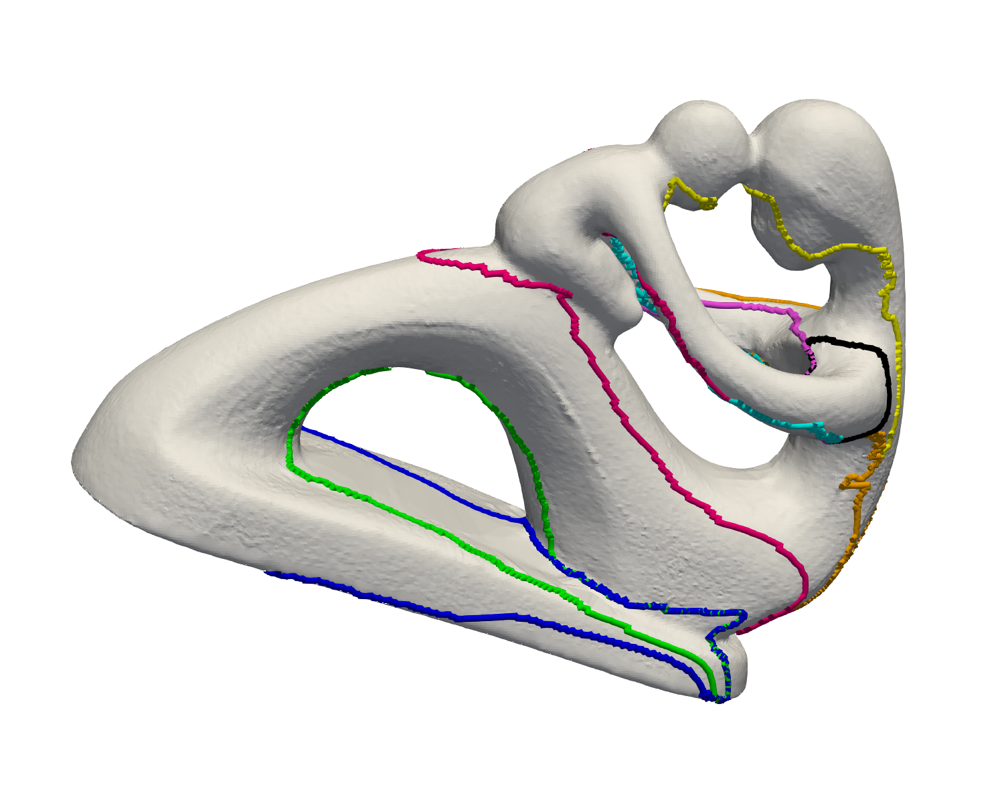

# 1次ホモロジー基底の計算

### 概略
サイクルの計算は，3次元モデルにテクスチャマッピングする際などに役立つ．
テクスチャマッピングでは3次元形状を2次元平面にパラメータ化することがよくあるが，トーラスのような穴の空いた形状の場合，曲面を複数に分ける必要がある．
サイクルを計算することで，曲面をどのように切れば良いかがわかる．

tree-cotree分解により，メッシュの2g（g=種数，穴の数）個の独立な非分離サイクルを計算する．  
メッシュの頂点集合をV，辺集合をEとし，グラフG=(V,E)を考える．

1. Gの全域木Tを計算．
1. G\*の全域木（T\*の辺は含まない）の辺集合，つまり，(E\\T)\*の全域木C\*を計算．
1. 残りの辺集合X=(E\\(T∪C))を計算．
1. Xの各辺の基本サイクルを計算．

### 実行結果

- 入力 : `fertility.obj`  
- 出力 : `fertility_nsc1.obj`~`fertility_nsc8.obj`
- 計算時間 : 1.49975秒
